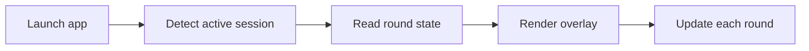

# murder-duels-script-hub

*A focused companion tool for Murder Duels players who want cleaner round information without digging through menus.*

## What this is

Murder Duels Script Hub is the home repository for a Murder Duels companion tool built for players who want faster, clearer decisions during a match. Murder Duels is a fast-paced round-based game where reads on the opposing player matter more than raw speed — this project exists to surface the information that already exists in the round, presented in a way that's easier to act on.

The tool runs alongside the game as a standalone Windows application. It does not modify game files, does not touch server communication, and does not claim to guarantee wins — it organizes what's already visible into something a player can glance at and use. Development is ongoing, and this repository is the reference point for what the tool currently does and how to get it.

  

The button above opens the project landing page, where the current build is available to download.

## Who it is for

- **Players learning Murder Duels' round timing** who want a clearer sense of what's happening on screen.
- **Regular duelists** who play enough matches to benefit from a consistent, repeatable overlay.
- **Players coming from similar round-based games** who expect a companion tool as part of normal play.
- **Streamers and content creators** who want a clean, readable interface for viewers.
- **Windows users** looking for a lightweight tool that doesn't require a development environment.

## What you can do

- **View round state at a glance** — see phase and timing information without checking menus.
- **Track opponent behavior patterns** across a session to inform future rounds.
- **Adjust overlay position and size** to fit your screen layout and stream setup.
- **Toggle individual display elements** on or off depending on what you want visible.
- **Switch between light and compact overlay modes** for different screen sizes.
- **Save your preferred layout** so it persists between sessions.
- **Run the tool independently** of any other software or launcher.
- **Update through the landing page** whenever a new build is published.

## Getting started

1. Open the landing page using the button above.
2. Download the current build for Windows.
3. Extract the files to a folder of your choice.
4. Run the application before or during a Murder Duels session.
5. Adjust the overlay position once, then leave it as-is for future sessions.

## Requirements

- Windows 10 or Windows 11.
- No installation of a development toolchain, runtime, or package manager.
- Standalone executable — no external dependencies to configure.
- A working display scaling setup (the overlay respects your system's DPI settings).

## How it works

The tool reads visible round information and renders it in a separate overlay window, rather than modifying anything inside the game itself.

1. The application starts and waits for an active Murder Duels session.
2. It identifies the current round state.
3. That state is passed to the overlay renderer.
4. The overlay updates continuously as the round progresses.
5. Your layout preferences are reapplied automatically on the next launch.

## Common Pitfalls

**"The overlay doesn't appear when I launch the game."**
Start the application first, then launch or switch to Murder Duels. Some window managers hide overlays that load before the target window exists.

**"Does this work with the mobile version of Murder Duels?"**
No. This build targets Windows desktop only. There is no mobile or console equivalent in this repository.

**"Will this get my account flagged?"**
The tool only reads and displays information already visible on screen; it does not alter game files or network traffic. That said, no third-party tool is entirely risk-free — use your own judgment.

**"Why does the overlay lag behind what's happening in the round?"**
This is usually a refresh-rate mismatch. Lowering the overlay's update interval in settings usually resolves it.

**"Can I use this on a laptop with a high-DPI display?"**
Yes. The overlay reads your system scaling automatically, but you can also set a manual scale factor if positioning looks off.

## Troubleshooting

- **Overlay is misaligned or partially off-screen** — reset position from the settings panel; this recalculates based on your current resolution.
- **Application won't launch** — confirm you extracted all files from the download rather than running from inside a compressed archive.
- **Settings don't persist between sessions** — check that the folder isn't in a location with restricted write permissions, such as certain protected system folders.
- **Overlay disappears after a Windows update** — display driver changes can reset window layering; relaunching the app usually fixes this immediately.

## License

This project is released under the [MIT License](LICENSE). It is provided as-is, without warranty of any kind, and without any guarantee of compatibility with future Murder Duels updates.

  

